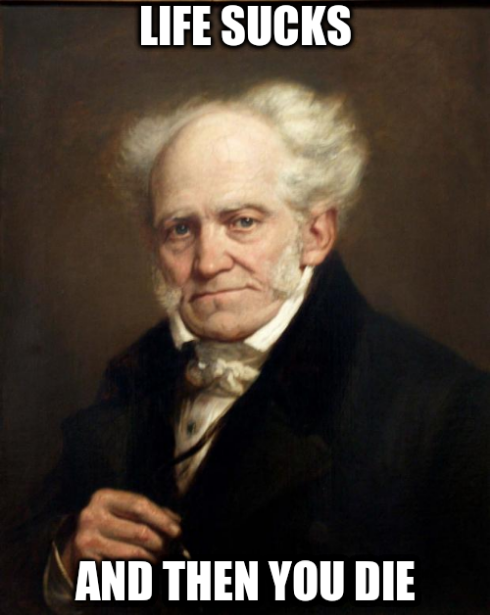
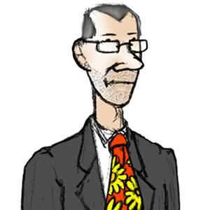
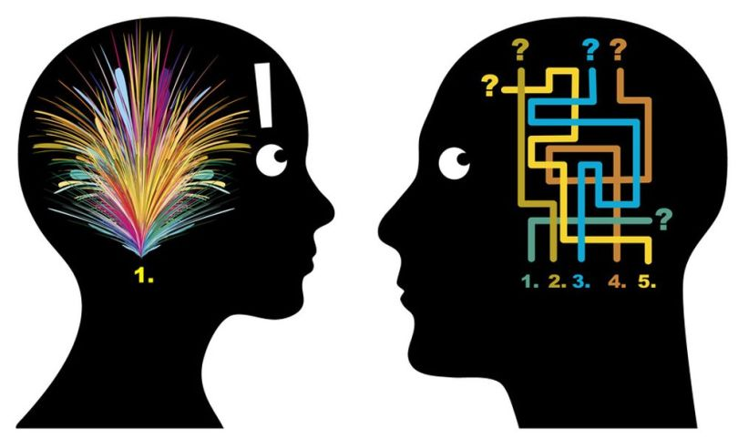

<!-- $theme: default -->

# PJNAPTRMVAT
###### Crée par Julien Dauliac ( [@Dauliac](https://github.com/dauliac) )

---
# PJNAPTRMVAT

###### Par Julien Dauliac ( [@Dauliac](https://github.com/dauliac) )

> *Pourquoi je n'ai pas toujours raison mais vous avez tort*

---
<!-- page_number: true -->

# L'art d'avoir toujours raison :hammer:

[Artur Schopenhauer](https://fr.wikipedia.org/wiki/Arthur_Schopenhauer)

---

## Stratagème n°13
Rejeter les potentielles antithèses en en présentant une.

>On pourrait ommettre que Charles n'est pas idiot, mais nous savons très bien que c'est faux.

---

## Stratagème n°30
L'argument d'autorité
 
> L’argumentum ad verecundiam

---
# Ne vous faites pas ~~baiser~~ biaiser

*distorsion dans le traitement cognitif d'une information*

---
<!-- page_number: false -->

## Bisou :kissing_heart::

Copyright &copy; 2018

###### sources :
- [L'art d'avoir toujours raison](https://fr.wikisource.org/wiki/L%E2%80%99Art_d%E2%80%99avoir_toujours_raison)
- [Liste de biais cognitifs](https://fr.wikipedia.org/wiki/Biais_cognitif#Liste_de_biais_cognitifs)